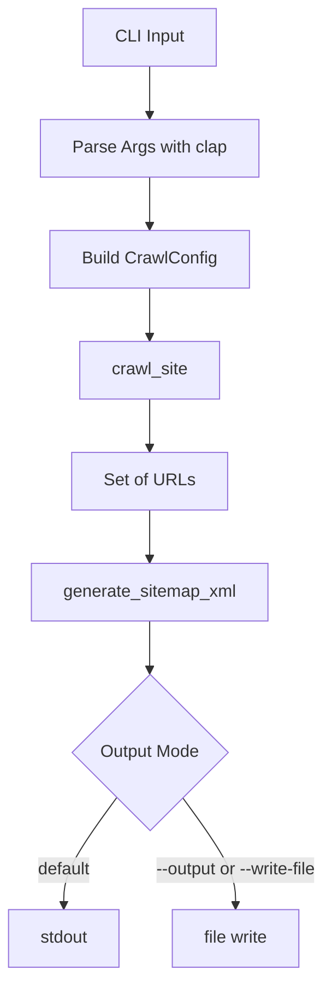

# lychee-sitemap Architecture

## Overview

lychee-sitemap is a Rust CLI that crawls a website and emits a valid sitemap XML document.

Primary goals:

- Crawl recursively from a single start URL.
- Restrict crawling to the same site.
- Deduplicate discovered URLs.
- Generate deterministic sitemap output.
- Keep XML output on stdout by default, with optional file output.

## High-Level Design

The application is split into two layers:

- CLI and runtime orchestration in src/main.rs
- Crawling and XML generation library logic in src/lib.rs

This separation keeps core behavior testable and reusable independent of CLI argument parsing.

## CLI Layer

The CLI accepts:

- Start URL
- Output options: --output or --write-file
- Crawl limits: --max-pages, --max-depth
- Parallelism: --concurrency
- Logging verbosity: -v, -vv, -vvv
- User-Agent override: --user-agent

Responsibilities:

- Validate URL input
- Construct CrawlConfig
- Initialize logging to stderr (JSON with timestamp)
- Call crawl and sitemap generation functions
- Route output to stdout or file
- Exit with non-zero status on error

## Crawl Engine

Core function: crawl_site(start_url, config) -> Result<BTreeSet<Url>, String>

Data structures:

- HashSet queued: tracks all seen/enqueued URLs to enforce deduplication before scheduling
- VecDeque queue: BFS-style frontier of pending URLs and depth
- BTreeSet crawled: successful URLs included in final sitemap
- JoinSet workers: bounded set of in-flight fetch tasks

Why these choices:

- HashSet gives O(1) average dedup checks.
- VecDeque supports efficient push/pop for queue semantics.
- BTreeSet keeps output sorted and deterministic.
- JoinSet enables bounded concurrency without unbounded task growth.

### Crawl Algorithm

1. Normalize start URL.
2. Seed queue and queued set with start URL.
3. While work exists:
   - Spawn fetch workers up to concurrency limit.
   - Wait for one worker to complete.
   - If response is successful:
     - Add URL to crawled.
     - If HTML and depth allows expansion, parse links and enqueue unseen links.
4. Stop when queue and workers are drained, or max page limit is reached.

### Concurrency Model

- Concurrency is bounded by config.concurrency (minimum effective value is 1).
- New tasks are spawned only while workers.len() < concurrency.
- The crawler processes completions as they arrive via join_next.
- On max page limit, outstanding workers are aborted.

This gives practical throughput gains while preserving crawl limits and dedup logic.

## URL Handling Rules

Normalization:

- Remove URL fragments (#...)
- Strip default ports for http:80 and https:443

Filtering:

- Only crawl http/https URLs
- Only crawl same scheme + host + effective port as the root site

Link extraction:

- Parse HTML and select anchor elements with href
- Resolve relative links against current page URL

## Fetch and Parse Pipeline

fetch_page returns a FetchResult containing:

- URL and depth
- Success flag
- Content type
- Optional body for HTML content

Behavior:

- Non-success HTTP status codes are treated as non-crawlable results
- Non-HTML content is accepted as a discovered page but not expanded recursively

## Sitemap Generation

Function: generate_sitemap_xml(urls)

Implementation details:

- Uses quick-xml Writer
- Emits XML declaration and urlset namespace required by sitemap protocol
- Writes one url/loc entry per crawled URL
- Produces UTF-8 String

Because input is a BTreeSet, output order is stable across runs for identical crawl results.

## Logging and Output

Logging:

- Uses tracing + tracing-subscriber
- Logs are JSON with system timestamp
- Verbosity levels:
  - default: WARN
  - -v: INFO
  - -vv: DEBUG
  - -vvv+: TRACE
- Logs are written to stderr

Output:

- Sitemap XML is written to stdout by default
- If file output is selected, XML is written to file
- Separation of stdout/stderr enables clean shell redirection for XML output

## Testing Strategy

The project currently uses multiple layers of tests:

### 1) Unit Tests (src/lib.rs)

- URL normalization behavior
  - verifies fragment removal and default port normalization
- XML generation behavior
  - verifies expected sitemap container and loc entries

### 2) Integration Test (tests/crawl.rs)

A local tiny_http server simulates a small site graph.

Coverage includes:

- Recursive traversal from root to linked pages
- Deduplication for fragment variants of the same URL
- Same-site filtering (external links are ignored)
- Handling of query-string variant URLs as distinct pages

This test validates realistic crawler behavior without external network dependencies.

### 3) CI Quality Gates (.github/workflows/ci.yml)

- cargo fmt --check
- cargo clippy with -D warnings
- cargo test on Linux, macOS, and Windows
- release build verification on all three OS targets

This ensures style, lint cleanliness, portability, and functional correctness in automation.

## Release Validation

Release workflow (.github/workflows/release.yml):

- Triggered on tags matching v\*
- Builds platform binaries
- Packages and publishes GitHub release assets

This does not replace tests; it packages tested code and automates binary distribution.

## Tradeoffs and Limitations

Current scope intentionally excludes:

- robots.txt compliance
- sitemap index generation for very large URL sets
- canonical URL normalization beyond fragment/default-port handling
- JavaScript-rendered navigation crawling
- retry/backoff policies and per-host rate limiting

These can be added incrementally depending on product goals.

## Suggested Future Testing Enhancements

- Property-based tests for URL normalization edge cases
- Integration tests for max_depth and max_pages boundary behavior
- Determinism test for output ordering under high concurrency
- Regression tests for redirects, non-HTML content, and error-heavy sites
- Optional end-to-end smoke tests against a fixture website container

## Summary

The architecture prioritizes correctness, deterministic output, practical concurrency, and testability. The library/CLI split and local integration testing provide a solid foundation for extending crawler capabilities while keeping behavior verifiable in CI.
